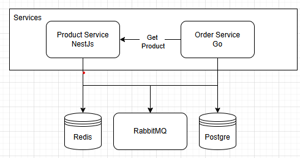

# Overview
A runner for showcase these showcases service : 
1. [product service](https://github.com/dodydestriady/ms-product-service)
2. [order service](https://github.com/dodydestriady/ms-order-service)



Following a microservices pattern with two services — Product Service (NestJS) and Order Service (Golang) — communicating asynchronously through RabbitMQ and sharing common infrastructure components like PostgreSQL and Redis.

- Product Service (NestJS)
Handles all product-related operations such as creating and retrieving product data. Use PostgreSQL as its main database, Redis for caching, and RabbitMQ to publish product-related events.

- Order Service (Golang)
Manages order product.  such as creating order and fetch order. It communicates with the Product Service (via HTTP and RabbitMQ) to validate product data before processing orders. Uses PostgreSQL for order storage and Redis for caching order details.

- RabbitMQ a message broker between services, enabling asynchronous communication and event-driven workflows.

- Redis For caching.

- PostgreSQL Each service has its own database to maintain data isolation.

# How to Run
To run this project you need :
1. Docker
2. Makefile

Then run this command
```
make setup
```
this will clone order service and product service repository inside this project, and run docker

For test with k6
```
make test
```

# API
## 1. Product
Create product
```
curl -X POST http://localhost:3000/products \
-H "Content-Type: application/json" \
-d '{"name": "Mechanical Keyboard", "price": 1200000, "qty": 100}'
```

Show Product
```
curl -X GET http://localhost:3000/products/:uuid \
-H "Content-Type: application/json"
```
## 2. Order
Create order
```
curl -X POST http://localhost:8000/orders \
-H "Content-Type: application/json" \
-d '{"productId": "uuid", "quantity": 100}'
```

Show order per product
```
curl -X GET http://localhost:8000/orders/product/:uuid \
-H "Content-Type: application/json"
```